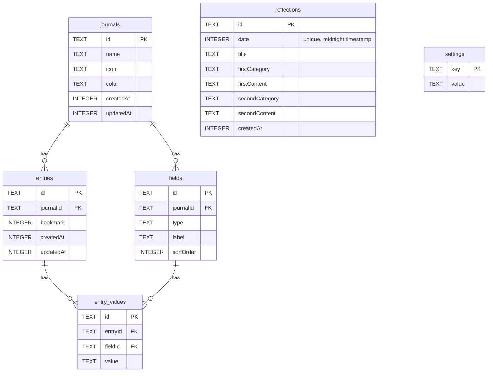

# CLAUDE.md

This file provides guidance to Claude Code (claude.ai/code) when working with code in this repository.

## Project Overview

Nicky is a React Native journaling app built with Expo and Expo Router. It features native iOS UI via `@expo/ui/swift-ui` (SwiftUI components), native tab navigation, and SQLite persistence via Drizzle ORM.

## Development Commands

```bash
pnpm expo run:ios          # Build and run on iOS simulator
pnpm expo start --clear    # Start Expo dev server (clear cache)
pnpm lint                  # Run ESLint
pnpm lint-fix              # Run ESLint with auto-fix
pnpm typecheck             # TypeScript type check
pnpm drizzle-kit generate  # Generate migration files from schema
```

## Commit Convention

Enforced by lefthook (pre-commit: lint, commit-msg: format):

```
feat: add new feature
fix: bug fix
refactor: refactoring
chore: tooling / config changes
```

## Architecture

### Routing Structure

```
src/app/
  _layout.tsx                  # Root — wraps everything in DrizzleProvider + NativeTabs
  (journal)/
    _layout.tsx                # Stack — scoped to journal tab
    index.tsx                  # Journal list  /
    create.tsx                 # Create journal  /create
    edit.tsx                   # Edit journal  /edit?journalId=...
    [id].tsx                   # Entry list  /[id]
    entry/
      create.tsx               # Create entry  /entry/create?journalId=...&journalName=...
      [id].tsx                 # Entry detail  /entry/[id]?journalName=...
  days/
    _layout.tsx                # Stack — scoped to days tab
    index.tsx                  # Daily reflection list
    settings.tsx               # AI reflection settings (model, time, enabled)
  search/
    _layout.tsx                # Stack — scoped to search tab
    index.tsx                  # Journal entry search
```

**Navigation flow:** Journal list → `[id]` (entry list) → `entry/[id]` (entry detail)

**Key rule:** `NativeTabs` is the root navigator; `Stack` lives inside each tab group (`(journal)`, `days`, `search`). This keeps the tab bar visible when pushing screens.

### Database Layer

Drizzle ORM + expo-sqlite. Schema is split by domain in `src/db/schemas/`:

| File             | Tables                                            |
| ---------------- | ------------------------------------------------- |
| `journals.ts`    | `journals`                                        |
| `fields.ts`      | `fields` (field definitions per journal)          |
| `entries.ts`     | `entries`, `entry_values`                         |
| `reflections.ts` | `reflections` (one AI-generated reflection/day)   |
| `settings.ts`    | `settings` (KVS — key/value pairs for app config) |



`src/db/schemas/index.ts` re-exports all schemas. `src/components/drizzle-provider.tsx` opens the DB, runs migrations via `useMigrations`, and exports `db`.

**Adding a schema change:** edit the relevant schema file → `pnpm drizzle-kit generate` → commit the generated files in `drizzle/`.

**Drizzle config notes:**

- Schema files must not import React Native packages (`expo-crypto`, `expo-symbols` runtime imports) — drizzle-kit runs in Node.js. Use `import type` for RN types.
- `$defaultFn` with `Crypto.randomUUID()` cannot be used in schema — generate IDs at the application layer instead.
- SQLite column names in Drizzle are **camelCase** (e.g. `sortOrder`, not `sort_order`). When writing raw SQL in `onConflictDoUpdate`, quote them: `excluded."sortOrder"`.

### `useLiveQuery` Reactivity Rules

`useLiveQuery` from `drizzle-orm/expo-sqlite` **only watches the root table** of a query — it does NOT automatically detect changes to tables joined via `with:`. The second argument is just `useEffect` deps, not additional table watchers.

**Pattern used in this codebase:** When a transaction modifies a related table (e.g. `fields`), also `touch` the root-table row so `useLiveQuery` re-runs:

```ts
// In updateJournal — touch entries.updatedAt so entry-list useLiveQuery detects the change
await tx.update(entries).set({ updatedAt: Date.now() }).where(eq(entries.journalId, journalId));
```

This means:

- `getEntriesQuery` (`entries` root) re-runs after any `fields` or `entry_values` change because those transactions touch `entries.updatedAt`
- `getFieldsQuery` (`fields` root) re-runs directly when `fields` is written — no touch needed

### Sub-component Pattern for Forms with `useRef` State

Hooks that use `useRef` + an `initialized` flag (e.g. `useEntry`, `useJournalField`) only initialize once per mount. To ensure they pick up fresh data when switching to edit mode, **mount the form as a separate child component** rather than toggling visibility on the parent:

```tsx
// ✅ Correct — EntryEditForm mounts fresh each time editMode becomes true
{editMode && <EntryEditForm entry={entry} onSave={...} />}

// ❌ Wrong — form is always mounted; useRef init won't re-run with new data
<EntryCreateView ... />  // toggled visible/hidden
```

This pattern is used in `entry/[id].tsx` (`EntryEditForm`) and `edit.tsx` (`JournalEditForm`).

### Field Value Serialization

All field values are stored as `text | null` in `entry_values.value`. Serialization/deserialization lives in `src/utils/entry/use-entry.ts`:

- `serializeValue(FieldValue) → string | null` — converts to DB text
- `deserializeValue(string | null, FieldType) → FieldValue` — converts from DB text
- `FieldType` values: `"text" | "longText" | "number" | "media" | "check" | "date" | "time" | "location"`
- Dates/times are stored as millisecond timestamps (`String(date.getTime())`)

`buildEntryFormData` in `src/utils/entry/entry-form.ts` extracts fields (sorted by `sortOrder`) and initial values from an `EntryDetailObj`.

### Entry Preview Pipeline

`EntryDetailObj` (raw DB join) → `PreviewEntryObj` (display) via `buildPreviewEntry` in `src/utils/entry/preview.ts`:

- First field value = title (falls back to formatted `createdAt`)
- Remaining field values joined with spaces = preview (also used for search)
- Entries grouped by month for the list view (`groupByMonth`)

### AI Reflection Pipeline

On-device LLM generates daily reflections from journal entries:

1. **Entry collection** — `src/db/queries/entries.ts` fetches all entries for a given day (`DailyEntryObj[]`)
2. **Text conversion** — `src/utils/days/reflection/get-reflection.ts` formats entries into structured text (journal name + field labels/values)
3. **LLM inference** — `@react-native-ai/llama` downloads a GGUF model, Vercel `ai` package's `generateText()` runs inference with a system prompt
4. **Parsing** — JSON output is extracted via regex and validated with `reflectionSchema` (Zod)
5. **Storage** — Result saved to `reflections` table (one per day, keyed by midnight timestamp)

**Supported models** (defined in `src/constants/ai-models.ts`): Gemma 3 4B, Qwen 3 4B, Phi-4 Mini — all Q4_K_M quantization from HuggingFace.

**Settings** are stored in the `settings` KVS table, managed by `src/hooks/settings/use-ai-reflection-settings.ts`:

- `aiReflectionEnabled` — on/off toggle
- `aiReflectionModelId` — selected GGUF model
- `aiReflectionTime` — time of day to auto-generate (via `use-auto-reflection.ts`)

### Keyboard Dismiss Rule

Always call `Keyboard.dismiss()` **before** any `async` save operation that triggers navigation. Skipping this causes a `RemoteTextInput` session crash on iOS when the keyboard is mid-input as the screen unmounts.

### Key Technologies

| Package                            | Usage                                                                                                                                                                                                   |
| ---------------------------------- | ------------------------------------------------------------------------------------------------------------------------------------------------------------------------------------------------------- |
| `expo-router`                      | File-based routing, `useRouter`, `useLocalSearchParams`                                                                                                                                                 |
| `@expo/ui/swift-ui`                | SwiftUI components: `Host`, `ZStack`, `VStack`, `HStack`, `Spacer`, `Grid`, `ScrollView`, `List`, `Section`, `Button`, `Image`, `Text`, `RoundedRectangle`, `ColorPicker`, `BottomSheet`, `ContextMenu` |
| `@expo/ui/swift-ui/modifiers`      | `frame`, `padding`, `foregroundStyle`, `onTapGesture`, `listStyle`, `presentationDetents`, `environment`, `fixedSize`, `font`, `lineLimit`                                                              |
| `expo-router/unstable-native-tabs` | `NativeTabs` — iOS native tab bar                                                                                                                                                                       |
| `expo-symbols`                     | `SymbolView` — SF Symbols in RN (non-SwiftUI) header components                                                                                                                                         |
| `expo-sqlite` + `drizzle-orm`      | Local SQLite persistence                                                                                                                                                                                |
| `expo-crypto`                      | `Crypto.randomUUID()` for ID generation at the app layer                                                                                                                                                |
| `PlatformColor`                    | Adaptive system colors: `"label"`, `"systemBackground"`, `"systemIndigo"`                                                                                                                               |
| `@react-native-ai/llama`           | On-device GGUF model download + inference via `downloadModel()` and `llama.languageModel()`                                                                                                             |
| `ai` (Vercel AI SDK)               | `generateText()` with structured prompts — used with llama model provider                                                                                                                               |

### SwiftUI Component Rules

- Always wrap SwiftUI components in `<Host>` with `useViewportSizeMeasurement`
- Use `onTapGesture` modifier for taps — `onPress` prop does NOT work on layout components
- `Button` inside `List` gets a blue tint by default — use `foregroundStyle({ type: "hierarchical", style: "primary" })` to keep the tap highlight without the blue color
- `List` manages its own scrolling — never nest it inside `ScrollView`
- Adaptive colors: use `PlatformColor("label")` directly — no need for `useColorScheme`
- `fixedSize()` on a component prevents it from stretching in an HStack, allowing siblings to fill remaining space
- Gradients: `RoundedRectangle` + `foregroundStyle({ type: "linearGradient", ... })` + `clipShape` on parent `ZStack`
- Native navigation bar buttons: use `unstable_headerRightItems` on `Stack.Screen` (not `headerRight` + RN `Pressable`)

### Naming Conventions

| Term    | Meaning                                             |
| ------- | --------------------------------------------------- |
| Journal | A category/collection (shown as a card in the grid) |
| Entry   | An individual record within a journal               |

## Code Style

- **Import order:** external → internal (`@/`) → relative; always separated by newlines
- **Path alias:** `@/*` → `src/*`
- **TypeScript:** strict mode enabled
- **Formatter:** Prettier (enforced via ESLint)
- **React Compiler:** enabled — do not manually add `useMemo`/`useCallback` unless there is a specific reason
- **Event handler note:** extract `e.nativeEvent.text` synchronously before passing to async state updaters (React synthetic event pooling)

<!--VITE PLUS START-->

# Using Vite+, the Unified Toolchain for the Web

This project is using Vite+, a unified toolchain built on top of Vite, Rolldown, Vitest, tsdown, Oxlint, Oxfmt, and Vite Task. Vite+ wraps runtime management, package management, and frontend tooling in a single global CLI called `vp`. Vite+ is distinct from Vite, and it invokes Vite through `vp dev` and `vp build`. Run `vp help` to print a list of commands and `vp <command> --help` for information about a specific command.

Docs are local at `node_modules/vite-plus/docs` or online at https://viteplus.dev/guide/.

## Built-in Commands vs Scripts

`vp <name>` runs a built-in command. `vp run <name>` runs a `package.json` script or a `vite.config.ts` task. Scripts cannot overwrite built-ins, so `vp dev` and `vp run dev` may do different things. Check `package.json` and `vite.config.ts` first, and run `vp run <name>` when the project defines a script or task with that name.

## Tool Versions

Run `vp toolchain` to show versions and relationships in the active Vite+
release. Add a tool name to select part of the graph. For example, run
`vp toolchain vite`. Use `--global` to ignore the local `vite-plus` package. Use
`vp why <package>` to show the package-manager dependency graph.

## Review Checklist

- [ ] Run `vp install` after pulling remote changes and before getting started.
- [ ] Run `vp check` and `vp test` to format, lint, type check and test changes.
- [ ] Check if there are `vite.config.ts` tasks or `package.json` scripts necessary for validation, run via `vp run <script>`.
- [ ] If setup, runtime, or package-manager behavior looks wrong, run `vp env doctor` and include its output when asking for help.

<!--VITE PLUS END-->
