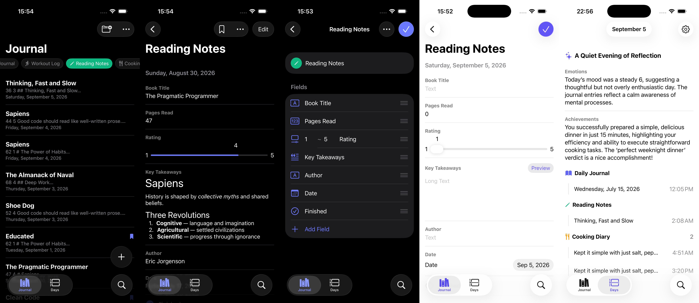

<div align="center">
  
</div>

# Nicky

🚧 Nicky is a native iOS journaling app built with React Native and Expo.



## Features

- **Custom Journals** — Create journals with flexible field types (text, number, date, time, location, media, check)
- **Daily Entries** — Record entries with bookmarking and full-text search
- **AI Reflection** — On-device LLM generates daily reflections from journal entries at a configurable time
- **Import / Export** — Import journal templates and export journals or entries
- **Native iOS UI** — Built with SwiftUI components via `@expo/ui/swift-ui`

## Nicky Pro

Nicky is open source. The [official App Store version](#) is free to use, with an optional **Nicky Pro** subscription that supports ongoing development:

- Unlimited journals and entries (free plan: 2 journals, 7 entries each)
- All field types (media, check, rating, location) and all journal icons
- Journal options: one entry per day, Face ID lock

AI reflection is free for everyone.

You are free to build Nicky yourself. Without a RevenueCat API key, in-app purchases are disabled and the free-plan limits apply — under the GPL-3.0 you may modify the source to change that for your own build.

## Building it yourself

Requirements: macOS with Xcode and [Vite+](https://viteplus.dev/guide/) (`vp`), which manages Node.js and the package manager. Expo Go is not supported — Nicky uses native modules, so it runs as a development build.

1. Install dependencies

   ```bash
   vp install
   ```

2. Create `.env.local` from the example and set `EXPO_PUBLIC_SIGNING_SECRET` to any random string (used to sign exported journals). The RevenueCat keys are optional.

   ```bash
   cp .env.example .env.local
   ```

3. Build and run on the iOS simulator

   ```bash
   vp run ios
   ```

After editing `.env.local`, restart the dev server with `vp run start` (it clears the cache) — `EXPO_PUBLIC_*` values are inlined at bundle time.

## Development

```bash
vp check           # Format, lint (Oxlint) and type check
vp run lint        # ESLint (expo lint)
vp run typecheck   # TypeScript
```

Project guides for contributors live in [`docs/guides`](docs/guides).

## License

Nicky is licensed under the [GNU General Public License v3.0](LICENSE).

Copyright (C) 2026 273*

You may use, modify and redistribute the source code under the terms of the GPL-3.0. Modified versions you distribute must also be released under the GPL-3.0 with their source code.

### Name and icon

The GPL-3.0 covers the source code only. The **Nicky** name, app icon and logo are not licensed for use in redistributed or modified versions. If you distribute your own build, please use a different name and icon.
