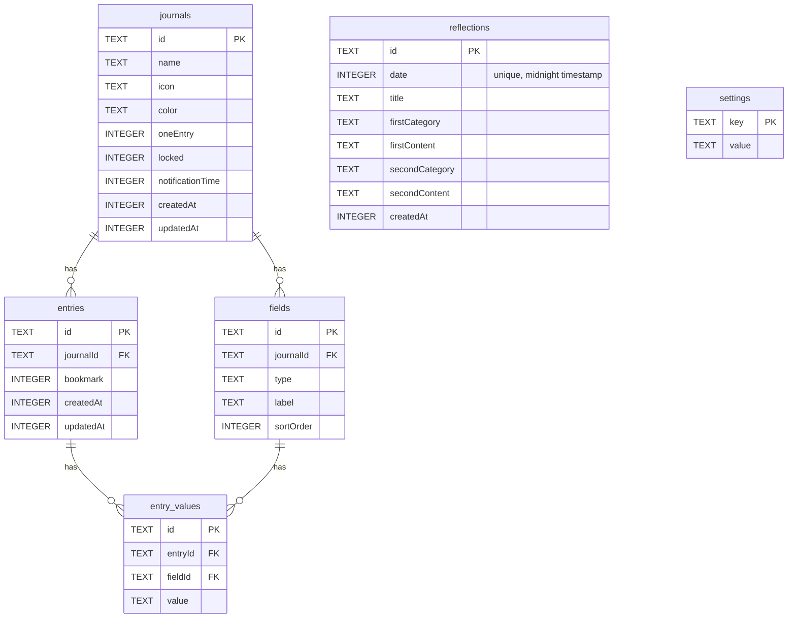

# Database

## Overview

Drizzle ORM + expo-sqlite. Schema is split by domain in `src/db/schemas/`:

| File             | Tables                                            |
| ---------------- | ------------------------------------------------- |
| `journals.ts`    | `journals`                                        |
| `fields.ts`      | `fields` (field definitions per journal)          |
| `entries.ts`     | `entries`, `entry_values`                         |
| `reflections.ts` | `reflections` (one AI-generated reflection/day)   |
| `settings.ts`    | `settings` (KVS — key/value pairs for app config) |



`src/db/schemas/index.ts` re-exports all schemas. `src/components/drizzle-provider.tsx` opens the DB, runs migrations via `useMigrations`, and exports `db`.

## Adding a Schema Change

Edit the relevant schema file → `pnpm drizzle-kit generate` → commit the generated files in `drizzle/`.

## Drizzle Config Notes

- Schema files must not import React Native packages (`expo-crypto`, `expo-symbols` runtime imports) — drizzle-kit runs in Node.js. Use `import type` for RN types.
- `$defaultFn` with `Crypto.randomUUID()` cannot be used in schema — generate IDs at the application layer instead.
- SQLite column names in Drizzle are **camelCase** (e.g. `sortOrder`, not `sort_order`). When writing raw SQL in `onConflictDoUpdate`, quote them: `excluded."sortOrder"`.

## `useLiveQuery` Reactivity Rules

`useLiveQuery` from `drizzle-orm/expo-sqlite` **only watches the root table** of a query — it does NOT automatically detect changes to tables joined via `with:`. The second argument is just `useEffect` deps, not additional table watchers.

**Pattern used in this codebase:** When a transaction modifies a related table (e.g. `fields`), also `touch` the root-table row so `useLiveQuery` re-runs:

```ts
// In updateJournal — touch entries.updatedAt so entry-list useLiveQuery detects the change
await tx.update(entries).set({ updatedAt: Date.now() }).where(eq(entries.journalId, journalId));
```

This means:

- `getEntriesQuery` (`entries` root) re-runs after any `fields` or `entry_values` change because those transactions touch `entries.updatedAt`
- `getFieldsQuery` (`fields` root) re-runs directly when `fields` is written — no touch needed
